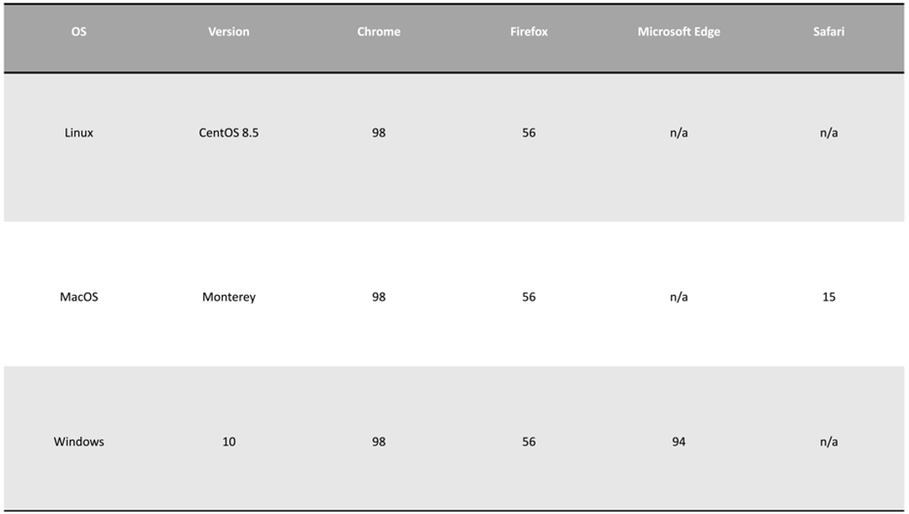

Vaccination is one of the most efficacious medical interventions. Viral vaccines save millions of people from the severity of diseases and death each year. Design of effective vaccine targets heavily depends on the sequence dynamics of viruses. Viral sequence diversity is a major challenge in effective vaccine design. The Vaccine Target Analyser (ViTA) is part of the ViVA ecosystem that aims to provide users with shortlisted vaccine target candidates for a given virus of interest. The candidates are highly conserved, functional, and immune-relevant sequences of the virus that potentially provide a broad coverage of the viral variants and are applicable to the human population at large.

## Browser Compatability

## Accessibility

ViTA is publicly available at: [https://dim-devel.bioinfo.perdanauniversity.edu.my](https://dim-devel.bioinfo.perdanauniversity.edu.my/).

## FrontEnd/BackEnd Frameworks

Python FastAPI is utilized for ViTA  Backend.
Typescript with ReactJS is utilized for ViTA  Frontend.
